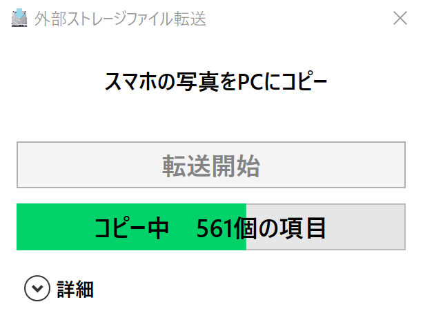

extstorage-filecopy
===

デジカメやスマートフォンなどのMTP/MSCデバイスのファイルをPCに同期するソフトです。
機器を接続して転送開始を押すとファイル差分をコピーして、コピー先をエクスプローラを立ち上げます。



## 設定ファイル

コピー先・元の情報は以下の様に設定ファイルに記載します。

`CopySetting_XXX.xml`
```xml
<?xml version="1.0" ?>
<trans>
  <setting title="スマホの写真をPCにコピー">
    <mediatype>MTP</mediatype>
    <srcvolname>HUAWEI nova</srcvolname>
    <srcdir>\内部ストレージ\DCIM\Camera\</srcdir>
    <destdir>G:\写真\</destdir>
    <extension>*.jpg</extension>
  </setting>
</trans>
```

## 実行方法

`ExtFileCopy.exe CopySetting_XXX.xml`
